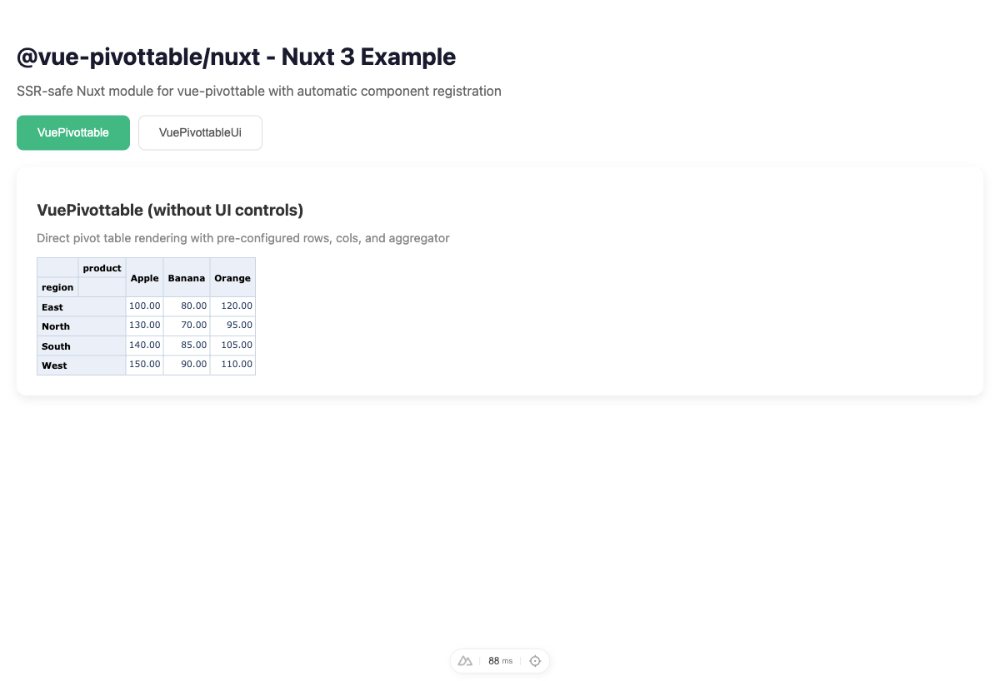
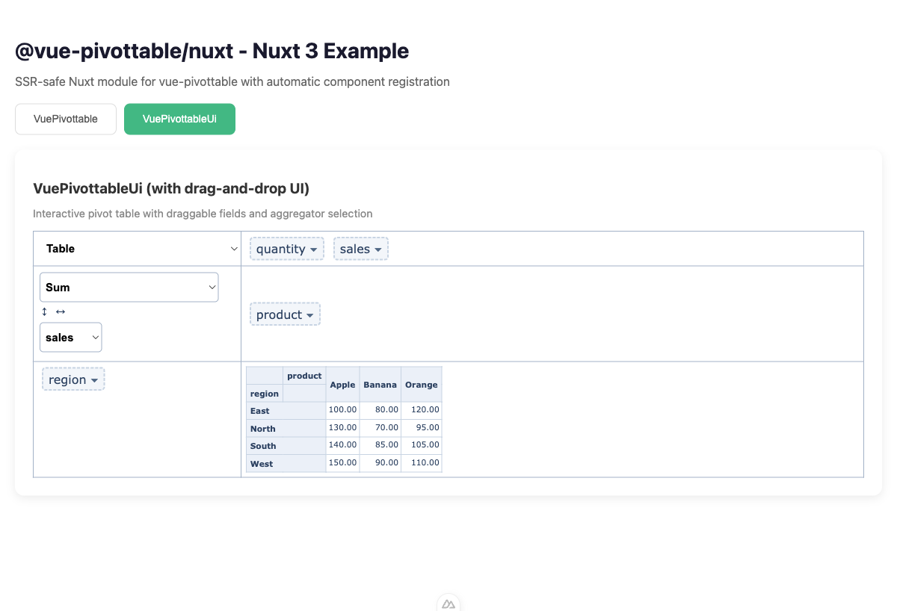
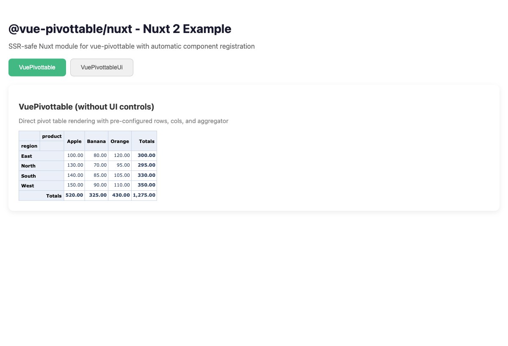
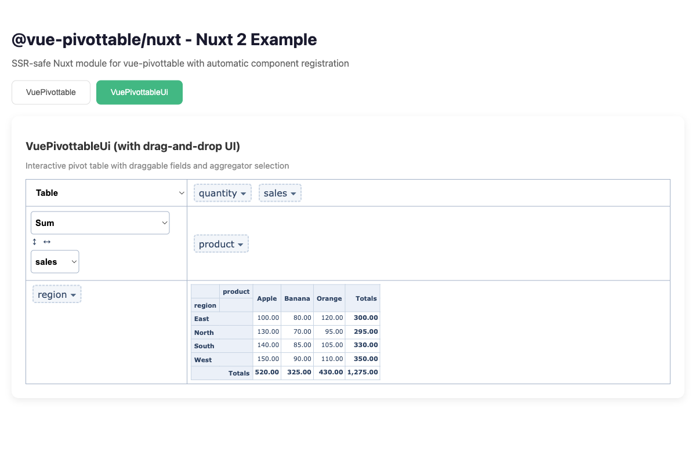

# @vue-pivottable/nuxt

Nuxt module for vue-pivottable. Supports both Nuxt 2 and Nuxt 3 with SSR-safe component registration.

## Version Compatibility

Nuxt is built on Vue, so each Nuxt version corresponds to a specific Vue version:

| Nuxt Version | Vue Version | vue-pivottable Version | Module Path |
|--------------|-------------|------------------------|-------------|
| Nuxt 2.x | Vue 2 | `^0.4.69` | `@vue-pivottable/nuxt/nuxt2` |
| Nuxt 3.x | Vue 3 | `^1.0.0` | `@vue-pivottable/nuxt` |

> **Note:** Nuxt 2 uses Vue 2 internally, and Nuxt 3 uses Vue 3. Make sure to install the correct version of `vue-pivottable` that matches your Nuxt/Vue version.

## Demo

- [Nuxt 3 Demo](https://nuxt3-pivottable.pages.dev/)
- [Nuxt 2 Demo](https://nuxt2-pivottable.pages.dev/)

## Screenshots

### Nuxt 3 (Vue 3)

**VuePivottable** - Direct pivot table rendering


**VuePivottableUi** - Interactive pivot table with drag-and-drop UI


### Nuxt 2 (Vue 2)

**VuePivottable** - Direct pivot table rendering (with Totals)


**VuePivottableUi** - Interactive pivot table with drag-and-drop UI


## Installation

```bash
pnpm add @vue-pivottable/nuxt

# For Nuxt 3 (Vue 3)
pnpm add vue-pivottable@^1.0.0

# For Nuxt 2 (Vue 2)
pnpm add vue-pivottable@^0.4.69
```

## Usage

### Nuxt 3

```ts
// nuxt.config.ts
export default defineNuxtConfig({
  modules: ['@vue-pivottable/nuxt']
})
```

Then use the components in your pages:

```vue
<template>
  <ClientOnly>
    <VuePivottable
      :data="data"
      :rows="['region']"
      :cols="['product']"
      aggregator-name="Sum"
      :vals="['sales']"
    />
  </ClientOnly>
</template>
```

### Nuxt 2

```js
// nuxt.config.js
export default {
  modules: [
    '@vue-pivottable/nuxt/nuxt2'
  ]
}
```

Then use the components in your pages:

```vue
<template>
  <client-only>
    <VuePivottable
      :data="data"
      :rows="['region']"
      :cols="['product']"
      aggregator-name="Sum"
      :vals="['sales']"
    />
  </client-only>
</template>
```

## Options

### Nuxt 3

```ts
// nuxt.config.ts
export default defineNuxtConfig({
  modules: ['@vue-pivottable/nuxt'],
  pivottable: {
    // Include CSS (default: true)
    css: true,
    // Register components globally (default: true)
    global: true
  }
})
```

### Nuxt 2

```js
// nuxt.config.js
export default {
  modules: [
    ['@vue-pivottable/nuxt/nuxt2', {
      // Include CSS (default: true)
      css: true
    }]
  ]
}
```

## Components

The module auto-registers these components:

| Component | Description |
|-----------|-------------|
| `<VuePivottable>` | Basic pivot table without UI controls |
| `<VuePivottableUi>` | Pivot table with drag-and-drop UI |

## SSR Support

This module automatically handles SSR by loading components only on the client side. No additional configuration is needed.

**Important:** Wrap your pivot table components with `<ClientOnly>` (Nuxt 3) or `<client-only>` (Nuxt 2) to prevent SSR hydration issues.

## Examples

See the [examples](./examples) directory for complete working examples:

- `examples/nuxt3` - Nuxt 3 example
- `examples/nuxt2` - Nuxt 2 example

To run the examples:

```bash
# Nuxt 3
cd examples/nuxt3
pnpm install
pnpm run dev

# Nuxt 2
cd examples/nuxt2
pnpm install
pnpm run dev
```

## License

MIT
